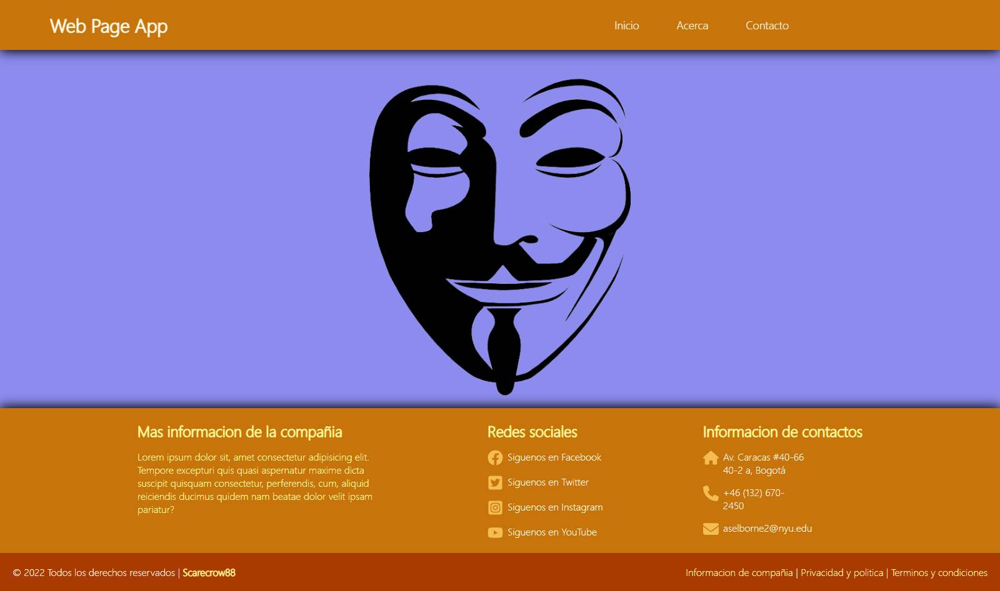
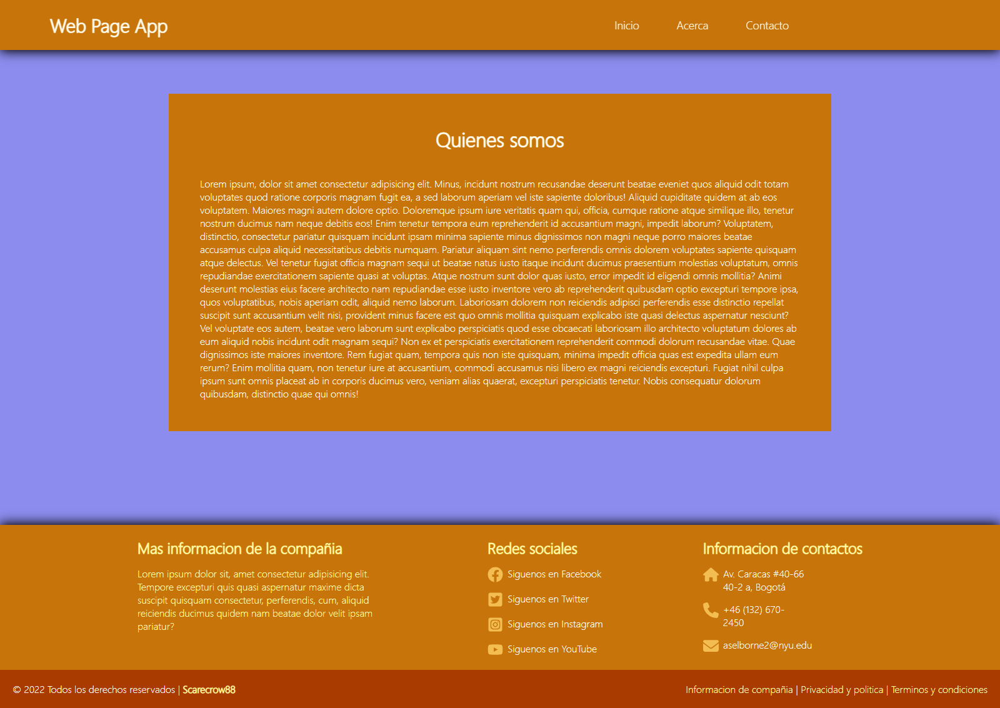
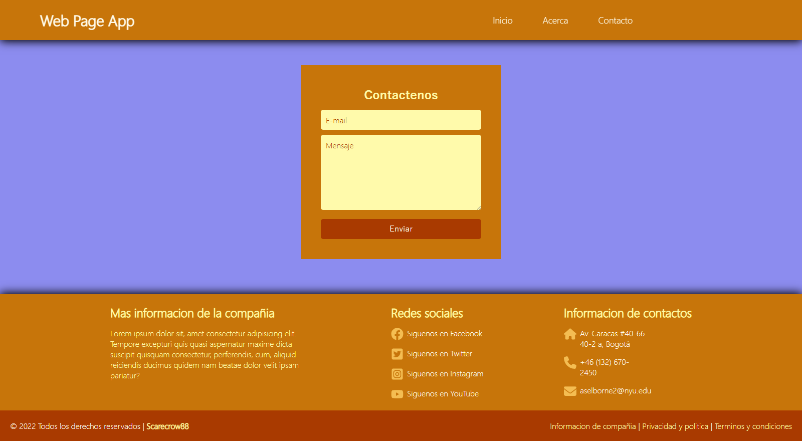

# Web Page App NodeJS Javascript HTML CSS
## Funcionalidades
- Muestra basica de rutas
## Tecnologías utilizadas
- **Backend:** Node.js, express
- **Frontend:** EJS, JavaScript, CSS
- **Motor de plantillas:** EJS
- **Logs del servidor:** morgan
- **Control de acceso entre dominios:** cors
- **Variables de entorno:** dotenv
## Arquitecturas
- Modelo vista controlador (MVC) 
- Modular
> Vista 1 de la pagina  
  
> Vista 2 de la pagina  
  
> Vista 3 de la pagina  
  
> Vista 4 de la pagina  
  
> Vista 5 de la pagina  
  